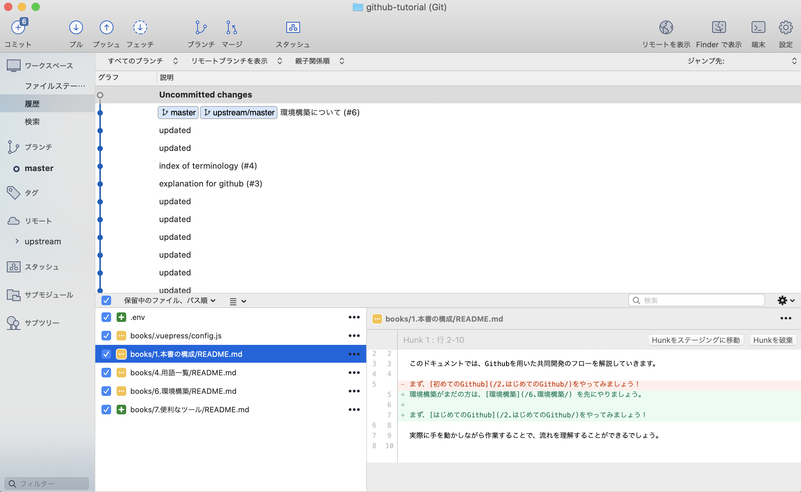

## SourceTreeの紹介

Githubのコマンド操作がどうしても慣れない、、

操作ミスするのが怖い、、

という方のために [SourceTree(ソースツリー)](https://www.sourcetreeapp.com/)というツールがあります。

こちらのサービスは、gitのコマンドで行う操作を直感的にボタンクリックで操作することが出来ます。

導入方法は[こちら](https://qiita.com/mitashun/items/2727a2f065aeb0ef7eaa) を参考にすると良いでしょう。

こちらからインストールできます。

[https://www.sourcetreeapp.com/](https://www.sourcetreeapp.com/)
